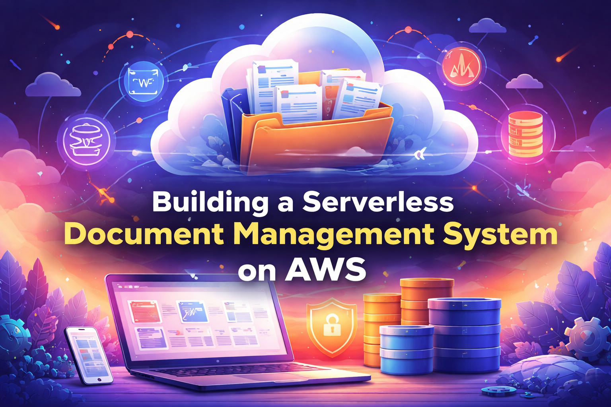
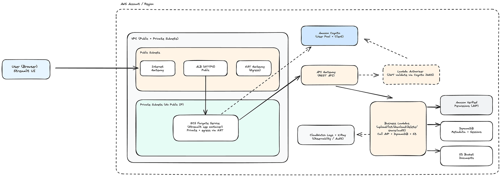
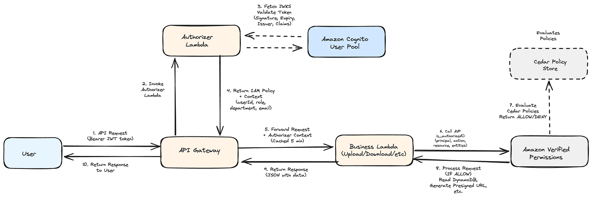
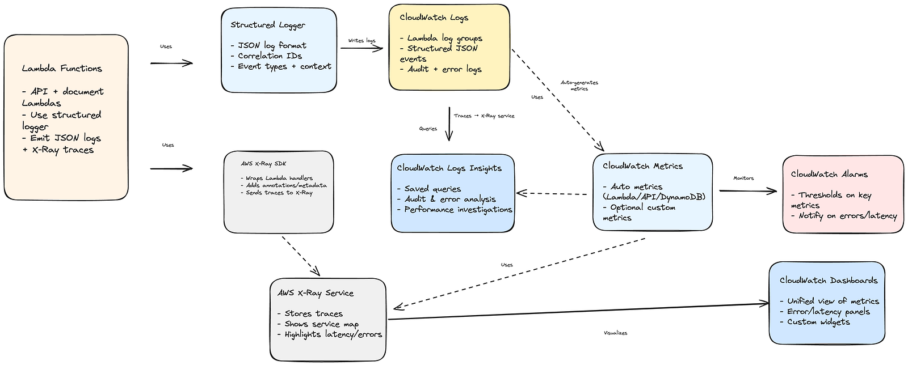
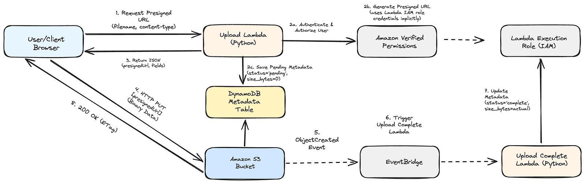

# AWS Document Management System

Enterprise-grade document management system built on AWS, showcasing production-style patterns for authentication, fine-grained authorization, observability, and operations.


<p align="center">
  
</p>


> [!NOTE]
> **Built with AI Assistance**
>
> | Area | Responsibility |
> |---|---|
> | Overall architecture, security model, and business rules | Designed and owned by a human |
> | Infrastructure (CDK, policies, wiring) | Co-developed with AI assistance |
> | Lambda business logic (Python) | Co-developed with AI assistance |
> | Streamlit admin UI | Initially scaffolded by AI, iterated and hardened by a human |

## Architecture


### Main architecture

<p align="center">
  
</p>


### API security (Cognito + AVP)

<p align="center">
  
</p>

### Observability (logs, metrics, traces)

<p align="center">
  
</p>

### Upload flow (presigned URLs + metadata)

<p align="center">
  
</p>

This project is split into **three main layers**:

- **Identity & Access**
  - **Amazon Cognito** – User authentication, MFA, and custom attributes (`role`, `department`)
  - **Amazon Verified Permissions (AVP)** – Cedar policies for role- and attribute-based access (`Admin`, `Manager`, `Editor`, `Viewer`)
  - **Lambda Authorizer** – Validates Cognito JWTs and passes identity/attributes to downstream Lambdas via `event.requestContext.authorizer`

- **Document APIs & Storage**
  - **Amazon API Gateway (REST)** – Fronts all document APIs (`/documents`, `/documents/{id}`, `/documents/{id}/share`, `/documents/{id}/audit`)
  - **AWS Lambda** – Upload, download, list, delete, share, audit, and background cleanup
  - **Amazon S3** – Encrypted document storage using presigned URLs (upload/download)
  - **Amazon DynamoDB** – Document metadata, ownership, department, and `shared_with` relationships

- **UI & Observability**
  - **Amazon ECS Fargate + ALB** – Hosts the Streamlit UI in private subnets behind an Application Load Balancer
  - **Amazon CloudWatch Logs + Logs Insights** – Structured JSON logging and ad‑hoc queries (audit trails, error analysis)
  - **Amazon CloudWatch Metrics, Dashboards, Alarms** – Service KPIs and alerting
  - **AWS X-Ray** – Distributed tracing for Lambda and external calls (Cognito, AVP, DynamoDB, S3)

Additional architecture diagrams live in `architecture/`:

- `full-architecture.png` – end‑to‑end system view (browser → Streamlit → Cognito → API Gateway → Lambdas → AVP/DynamoDB/S3)
- `api-security.png` – detailed API authn/authz flow (Cognito JWTs, Lambda authorizer, AVP)
- `observability.png` – logs, metrics, and traces (CloudWatch + X-Ray)
- `upload-document.png` – presigned URL upload flow with pending/complete metadata in DynamoDB

## Project Structure

```text
.
├── infrastructure/             # AWS CDK infrastructure code (networking, auth, authz, compute, observability)
│   ├── app.py                  # CDK application entry point
│   ├── policies/               # Amazon Verified Permission Cedar Policies
│   ├── stacks/                 # CDK stack definitions (VPC, Cognito, AVP, API/Lambdas, ECS, CloudWatch)
│   └── requirements.txt        # Python dependencies for CDK
├── lambda_functions/           # Lambda function code
│   ├── authorizer/             # API Gateway Lambda authorizer (Cognito JWT verification)
│   ├── upload/                 # Initiate upload + presigned URL + pending metadata
│   ├── upload_complete/        # S3/EventBridge-triggered completion → update metadata to `complete`
│   ├── download/               # Generate presigned download URL
│   ├── list/                   # List + AVP authorization + “shared with me” filtering
│   ├── delete/                 # Delete metadata + S3 object
│   ├── share/                  # Update `shared_with` in DynamoDB (policies read it from AVP)
│   ├── audit/                  # Query CloudWatch Logs Insights for per-document audit logs
│   └── common/                 # Shared utilities (structured logger, retry helpers, etc.)
├── app/                        # Streamlit web application (admin & user UI)
│   ├── app.py                  # Main multi-page app entry
│   ├── pages/                  # Documents, Upload, Share, Audit, Admin pages
│   ├── auth.py                 # Cognito auth, token handling, session bootstrap
│   ├── api_client.py           # Python client for the API Gateway endpoints
│   ├── config.py               # Config file
│   ├── session_manager.py      # Optional DynamoDB-backed Streamlit session 
│   ├── Dockerfile              # Container image for ECS Fargate
│   └── requirements.txt        # Python dependencies for Streamlit
└── architecture/               # Contains architecture diagram
└── build_and_push_streamlit.sh # Contains logic to build and push app via dockeer locally to ECR
└── create_admin_user.py        # Contains logic to create Admin user
└── README.md                   # This file
```

## Getting Started

### Prerequisites

- Python 3.11 or later
- AWS CLI configured with appropriate credentials
- Node.js and npm (for AWS CDK CLI)
- Docker (for building and pushing the Streamlit image)

### Infrastructure

1. Install AWS CDK CLI:

```bash
npm install -g aws-cdk
```

2. Set up the CDK project and dependencies:

```bash
cd infrastructure
python3 -m venv .venv
source .venv/bin/activate
pip install -r requirements.txt
```

3. Deploy infrastructure (VPC, Cognito, AVP, Lambdas, API Gateway, ECS, CloudWatch):

```bash
cdk bootstrap      # First time only per account/region
cdk deploy         # Deploy all stacks
```

### Streamlit Application (UI)

See the dedicated docs for details:

- [Infrastructure README](infrastructure/README.md)
- [Lambda Functions README](lambda_functions/README.md)
- [Streamlit App README](app/README.md)
- `build_and_push_streamlit.sh` – helper script for building and pushing the Streamlit container

At a high level:

1. Build and push the `app/` Docker image to ECR.
2. Update the ECS service (via CDK outputs or `build_and_push_streamlit.sh`) to roll out the new image.
3. Access the Streamlit UI via the ALB URL output from the ECS stack.

## Core Features

- **Authentication**
  - Cognito user pool with email sign‑in, and admin‑created users
  - Streamlit login flow using Cognito’s `USER_PASSWORD_AUTH`

- **Fine-Grained Authorization with AVP + Cedar**
  - **Admin** – full access to all documents (read/write/delete/share)
  - **Manager** – manage documents in their department (read/write/delete/share)
  - **Editor** – read/write documents they own or that are shared with them
  - **Viewer** – read‑only access to documents shared with them
  - Document sharing implemented via `shared_with` in DynamoDB; Cedar policies reference `resource.sharedWith.contains(principal.userId)`

- **Document Management**
  - Upload via presigned URL (Lambda → S3) with pending/complete metadata in DynamoDB
  - Download via signed URLs (time‑bound access)
  - List views:
    - “All documents” (subject to AVP)
    - “My documents”
    - “Shared with me”
  - List, Delete and share actions wired to AVP decisions (owner/admin/manager/explicit sharing)
  - Audit logs per document via dedicated audit Lambda + CloudWatch Logs Insights

- **Observability**
  - Structured JSON logs in CloudWatch Logs for all Lambdas
  - AWS X-Ray instrumentation on Lambdas and AWS SDK calls
  - CloudWatch Metrics + Dashboards for Lambda, API Gateway, and DynamoDB
  - CloudWatch Alarms for key error/latency signals

## Security

- Data encrypted at rest (S3, DynamoDB) and in transit (HTTPS)
- Least‑privilege IAM roles per Lambda and ECS task
- VPC isolation for ECS tasks and (optionally) Lambdas, with NAT for egress
- Presigned URLs with short expiration for S3 access
- API Gateway rate limiting and usage plans

## Testing

The system is designed to support:

- Unit tests for Lambda handlers and shared utilities
- Property-based tests for Cedar policies (e.g., manager/department access)
- Integration tests for end‑to‑end flows (upload → share → list → download → audit)

## License

This project is provided for educational and demonstration purposes. Use it as a reference or starting point; review and adapt it before running in production.
